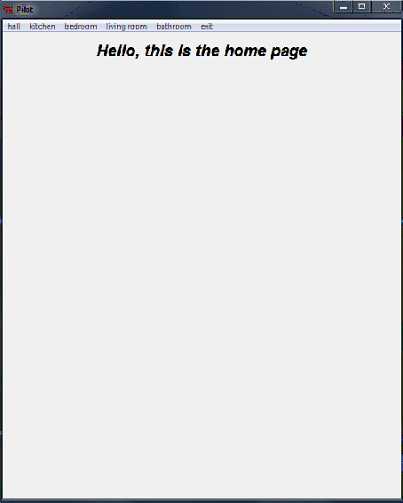
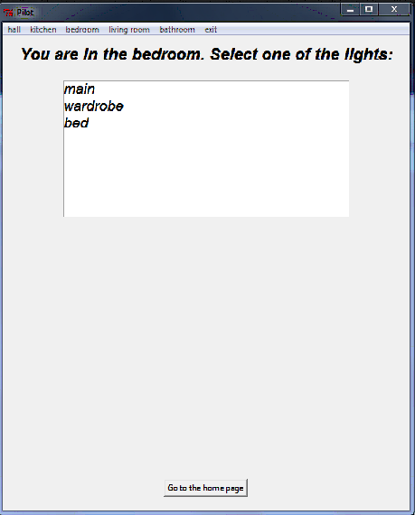
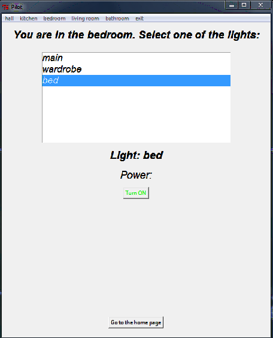
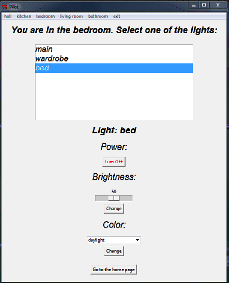
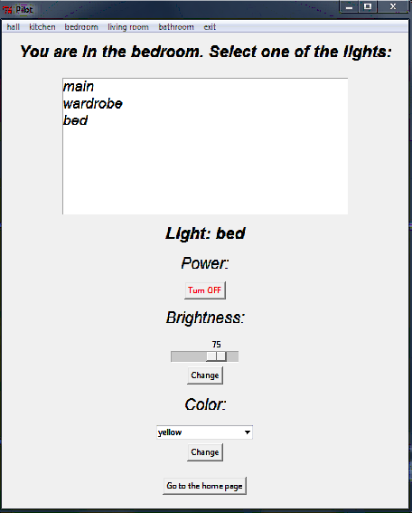

# IntelligentHome

Aplikacja pozwalająca wydawać polecenia przesyłane poprzez sieć do inteligentnego domu, a dokładnie serwera MQTT.
Serwer MQTT może być uruchomiony zarówno lokalnie jak i na chmurze. <br>
Aplikacja również sluży do nasłuchiwania konkretnych zdarzeń w celu wizualizowania stanu poszczególnych urządzeń.
Wizualizacja odbywa się za pomocą pythonowego GUI [tkinter](https://docs.python.org/3/library/tkinter.html) po wczytaniu danych konfiguracyjnych ([przykład](https://github.com/nazkord/IntelligentHome/blob/master/config.json))

## Stack technologiczny
- Python
- Tkinter GUI
- Mosquitto MQTT Broker

## Instrukcja uruchomienia
- Na systemie operacyjnym należy mieć zainstalowany python
- Pobrać mosquitto mqtt broker i uruchomić broker na porcie 1883 (domyślny) [Instukacja](https://mosquitto.org/download/)
- Następnie wykonać serie poleceń
```bash 
git clone https://github.com/nazkord/IntelligentHome.git
cd IntelligentHome-master
pip install -r requirements.txt
python main.py
```

## Konfiguracja

Cała konfiguracja aplikacja jest wczytywana z pliku [config.json](https://github.com/nazkord/IntelligentHome/blob/master/config.json)

### Przykładowa konfiguracja pokoju

```json
{
    "name": "bedroom",
    "lighting": [
      {
        "name": "main",
        "colors": [
          "daylight",
          "blue",
          "cyan"
        ]
      },
      {
        "name": "wardrobe",
        "colors": [
          "daylight",
          "red",
          "yellow"
        ]
      },
      {
        "name": "bed",
        "colors": [
          "daylight",
          "pink",
          "yellow",
          "magenta",
          "green",
          "red",
          "cyan"
        ]
      }
    ]
}
```
- ```"name"``` – nazwa pokoju
- ```"lighting"``` – tablica oświetlenia w pokoju
### Przykładowa Konfiguracja lampy
```json
{
    "name": "main",
    "colors": [
      "daylight",
      "blue",
      "cyan"
    ]
}
```
- ```"name"``` – nazwa oświetlenia/lampy
- ```"colors"``` – tablica możliwych oświetlanych kolorów

## Interfejs

- Widok głównego ekranu aplikacji



- U góry znajduję się menubar z której wybiera się konkretny pokój. Po wybraniu konkretnego pokoju wyświetlana jest lista świateł. 



- Również z poziomu każdego pokoju/ekranu można wyjść z aplikacji korzystając z przycisku ```exit```
- Każde światło domyślnie jest wyłaczone więc najpierw należy go włączyć



- Po włączeniu światła wyświetlane są wszystkie jego parametry, które można z łatwością zmieniać klikając przycisk ```change```



- Zmienione parametry



## Testowanie

## Rozwijanie aplikacji

Done by [nazkord](https://github.com/nazkord)
