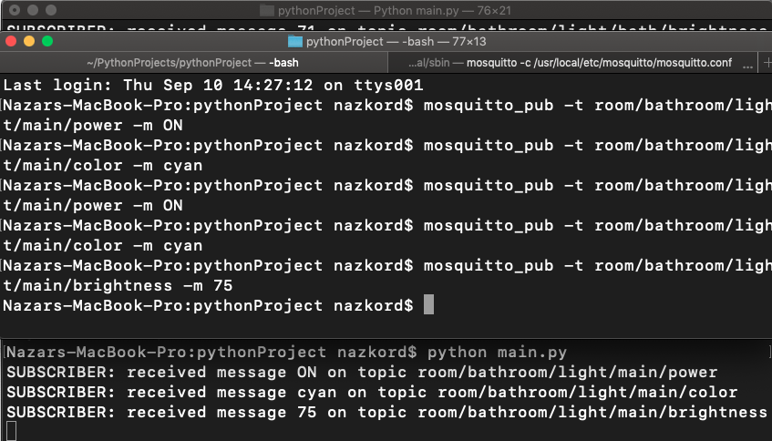

# IntelligentHome

Aplikacja pozwalająca wydawać polecenia przesyłane poprzez sieć do inteligentnego domu, a dokładnie serwera MQTT.
Serwer MQTT może być uruchomiony zarówno lokalnie jak i na chmurze. <br>
Aplikacja również sluży do nasłuchiwania konkretnych zdarzeń w celu wizualizowania stanu poszczególnych urządzeń.
Wizualizacja odbywa się za pomocą pythonowego GUI [tkinter](https://docs.python.org/3/library/tkinter.html) po wczytaniu danych konfiguracyjnych ([przykład](https://github.com/nazkord/IntelligentHome/blob/master/config.json))

## Stack technologiczny
- Python
- Tkinter GUI
- Mosquitto MQTT Broker

## Instrukcja uruchomienia
- Na systemie operacyjnym należy mieć zainstalowany python
- Pobrać mosquitto mqtt broker i uruchomić broker na porcie 1883 (domyślny) [Instukacja](https://mosquitto.org/download/)
- Następnie wykonać serie poleceń
```bash 
git clone https://github.com/nazkord/IntelligentHome.git
cd IntelligentHome-master
pip install -r requirements.txt
python main.py
```

## Konfiguracja

Cała konfiguracja aplikacji jest wczytywana z pliku [config.json](https://github.com/nazkord/IntelligentHome/blob/master/config.json)

### Przykładowa konfiguracja pokoju

```json
{
    "name": "bedroom",
    "lighting": [
      {
        "name": "main",
        "colors": [
          "daylight",
          "blue",
          "cyan"
        ]
      },
      {
        "name": "wardrobe",
        "colors": [
          "daylight",
          "red",
          "yellow"
        ]
      },
      {
        "name": "bed",
        "colors": [
          "daylight",
          "pink",
          "yellow",
          "magenta",
          "green",
          "red",
          "cyan"
        ]
      }
    ]
}
```
- ```"name"``` – nazwa pokoju
- ```"lighting"``` – tablica oświetlenia w pokoju
### Przykładowa konfiguracja lampy
```json
{
    "name": "main",
    "colors": [
      "daylight",
      "blue",
      "cyan"
    ]
}
```
- ```"name"``` – nazwa oświetlenia/lampy
- ```"colors"``` – tablica możliwych oświetlanych kolorów

## Interfejs

- Widok głównego ekranu aplikacji


- U góry znajduję się menubar z którego wybiera się konkretny pokój. Po wybraniu konkretnego pokoju wyświetlana jest lista świateł. 


- Także z poziomu każdego pokoju/ekranu można wyjść z aplikacji korzystając z przycisku ```exit```
- Każde światło domyślnie jest wyłaczone, więc najpierw należy go włączyć


- Po włączeniu światła wyświetlane są wszystkie jego parametry, które można z łatwością zmieniać klikając przycisk ```change```


- Zmienione parametry


## Działanie aplikacji

- Po każdym wciśnięciu przycisku ```change``` wysyłany jest za pomocą Publisher'a komunikat z odpowiednim tematem do brokera MQTT.
- W osobnym wątku uruchomiony jest Subscriber, który nasłuchuje zdarzenia wysyłane z urzadzeń, dzięki czemu wizualizacja pilota jest zawsze aktualna.

## Testowanie

Aby samemu przetestować działanie aplikacji, należy za pomocą wiersza poleceń wysłać przykładowe komunikaty do brokera MQTT.
Przykłady komunikat:
- Temat: ```room/<room_name>/light/<light_name>/<parameter_to_change>```
- Treść: ```<new value of parameter>``` <br>
Wysyłanie komunikatu odbywa się za pomocą ```mosquitto_pub``` <br>
Przykładowe wysyłanie komunikatu:
- ```mosquitto_pub -t room/bathroom/light/main/power -m ON```
Przykład działania:
- Uruchomione komendy oraz logi z ```subscriber'a```



- Zaktualizowany widok pilota


## Rozwijanie aplikacji

Aplikacja jest otwarta na kolejne rozszerzenia, dzięki temu, że przy jej tworzeniu, użyłem dużo klas, które pozwalają w łatwy sposób rozszerzyć aplikacje o nowe urządzenia.
Aby wprowadzić kolejne urządzenia w pokojach (drzwi, okna) wystarczy wykonać następujące kroki:
- Dodać nowe urządzenie do pliku konfiguracyjnego JSON
- Dodać metodę parsującą te urządzenie do Parser'a
- Dodać UI odpowiadający za wyświetlenie oraz zmianę parametrów tego urządzenia
- Dodać do Subscriber'a metodę aktualizującą stan urządzenia.

Done by [nazkord](https://github.com/nazkord)
